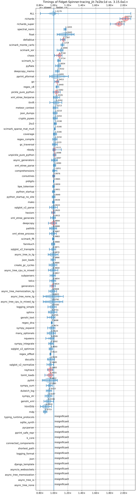

# A Plan for 5-10%* Faster Free-Threaded JIT by Python 3.16

08-Nov-2025

During the Python Core Dev Sprint in Cambridge hosted by ARM, we planned to make the JIT in CPython 5% faster by 3.15 and 10% faster by 3.16. The planners present were Savannah Ostrowski, Mark Shannon, Ken Jin (me), Diego Russo and Brandt Bucher. We were accompanied by other CPython core team members as well.

You might wonder: 5% seems awfully conservative. However, note that this figure is the *geometric mean*. The number can range from slower to significantly faster. All numbers are [pyperformance](https://github.com/python/pyperformance) figures.

In my [previous blog post](./jit-reflections.md), I talked about the Python 3.13 and 3.14 JIT's state. We're planning to change that for 3.15 and 3.16.

## The Plan for 3.15
This is a paraphrase of what Savannah laid out [here](https://github.com/python/cpython/issues/139038). The difference is that I'm listing things in chronological order of what I expect will be merged into CPython.

1. Profiling support via LLVM 21.
2. Trace recording JIT.
3. Better machine code.
4. Register allocation/Top-of-Stack Caching.
5. Reference count elimination.
6. More constant promotion.
7. Basic Free threading support.


### Profiling support via LLVM 21

Profiling and debugger support is a must-have if we want the JIT to be production-ready. The JIT uses [Copy-and-patch](https://dl.acm.org/doi/10.1145/3485513) compilation to create its templates/stencils. Thanks to Savannah, we have support for [LLVM 20](https://github.com/python/cpython/issues/136895) and soon LLVM 21. LLVM 21 in theory should allow us to support stack unwinding through the JIT frames. This would allow debuggers and other tools to see the JIT code as a single frame. Currently the debugger I use gets lost when it tries to introspect JIT code.

I can't explain more, because I don't know anything about debuggers and profilers :(.

### Trace recording JIT

Our current JIT region selection algorithm could be improved. Here's the current pipeline:


The *region selector*, aka. the JIT frontend, uses *trace projection*. In short, we guess where the traces will go, and use historical data from the interpreter's [inline caches](https://en.wikipedia.org/wiki/Inline_caching) to feed type information into our IR.

There are two problems with the above:
1. CPython's inline caches are [monomorphic](https://en.wikipedia.org/wiki/Inline_caching#Monomorphic_inline_caching) to save space. We thus have little concept of distributions or historical data. The only information we have is "cache hit" or "cache miss". This causes historical data to be stale/contradictory in our IR very often.
2. We need a lot of interpreter involvement to record where our code will execute next. For example, if we saw a call, we would inline the call into the call site based on the inline cache entry information. However, this is a best-effort guess due to the previous point. Generators are completely unhandled. Custom dunders are punted. You get the point.

Other tracing JIT compilers like PyPy and TorchDynamo (`torch.compile`). Use some form of trace recording. This is not entirely true for TorchDynamo, as that seems to introspect values then do a symbolic interpretation over the bytecode. However, the key point is that live up-to-date information is present in both these systems.

At the core dev sprint, Brandt nerd-sniped me to rewrite the entire JIT frontend. Using my free time in the past 2 months, I have done so. The [preliminary results](./media/bm-20251108-vultr-x86_64-Fidget%252dSpinner-tracing_jit-3.15.0a1+-7e2bc1d-vs-base.png) are: 1k more loc, roughly 1.5% faster geometric mean average on pyperformance. 100% faster (!!! hopefully not a [bug](./apology-tail-call.md) on the most improved benchmark (richards), and 15% slower on the slowest benchmark. The new JIT frontend now also supports generators (partially), custom dunders, object initialization, etc.


(Image credits to Meta's Free-Threading Benchmarking Runner). Anything below 1.00x on the graph is a slowdown.

The details of the impplementation are quite interesting to me, so you might want to give the [PR](https://github.com/python/cpython/pull/140310) a read. The key idea is to maintain two dispatch tables in a mechanism I call "dual dispatch". One table is the standard interpreter, the other is the tracing interpreter. we (ab)use computed gotos/tail calling to dispatch from one table to the other.

### Better machine code generation

Copy-and-Patch allows us to generate machine code templates with little effort. However, the base implementation of it without much optimizations does not yield much speedup on CPython. In the original paper, the Copy-and-Patch authors implemented other transformations in LLVM to produce better code for the JIT. We will be doing something similar.

Mark and Diego are working on better codegen for AArch64. For example, see [#140683](https://github.com/python/cpython/issues/140683), [#139757](https://github.com/python/cpython/issues/139757).

Brandt is also working on better code generation in general. The most interesting one (in my opinion) comes from the Copy-and-Patch paper which is to rearrange assembly control-flow to optimize the chances of things falling-through. In Brandt's [issue](https://github.com/python/cpython/issues/135904), he invertes branches in assembly code to increase the chance of that. The idea is pretty simple, but produces a 1% geometric mean speedup on pyperformance. Here's how it looks like. If you have the following assembly (example taken from the issue):

```asm
cmpq    $0x1, -0x10(%r13)
je      _JIT_CONTINUE
jmp     _JIT_JUMP_TARGET
```

`_JIT_CONTINUE` points to the next micro-operation to execute. `_JIT_JUMP_TARGET` points to a deoptimization target. The hot main path is `_JIT_CONTINUE` and the cold path in the bad case is `_JIT_JUMP_TARGET`. You can optimize it to look like this instead:

```asm
cmpq    $0x1, -0x10(%r13)
jne      _JIT_JUMP_TARGET
```

This has the effect of causing the JIT to "fall-through" to the next instruction without any jumps. The jump is only taken in the uncommon deoptimization path! This means in the hot path, no jumps are taken. Modern branch predictors are quite complex, but it seems this performs better (at least on our benchmarks) on our hardware versus the old code.

Another idea is hot-cold splitting, but we don't have PR up for that yet, so you'll have to read the issue above!

### Register allocation/Top-of-stack caching

Register allocation is likely one of the most worthwhile optimizations a compiler can do. The CPython bytecode interpreter is a *stack machine*. This means it pushes and pops from an operand stack instead of registers when performing computation. Think of an infinite register machine, but everything lives on the stack.

For obvious reasons, the stack is slower than registers. Luckily in 1995, Anton Ertl proposed a [solution](https://dl.acm.org/doi/10.1145/207110.207165) to cache the stack in registers. The key idea is to maintain a state machine of the stack. State transitions are loads/spills from registers to the stack and vice versa. Each state represents what is in the stack and what is in registers. Note that this state machine need only be maintained by the JIT optimizer. After the analysis pass, it need not be kept around.

Mark is working on [this](https://github.com/python/cpython/issues/135379). We aren't as advanced as what Ertl proposes in the paper. However it's a good start. The preliminary results are roughly a 0.5% geometric mean speedup on pyperformance, with the highest speedup on nbody at 16%. You might be surprised that this number isn't higher. More on that in the next paragraph.

The main problem is actually due to CPython's reference count semantics. Simply put, CPython tracks object's liveness using reference counting and tracing garbage collection. The problem with this is that Python supports arbitrary finalizers (`__del__`). This means anywhere that decrements a reference count could call arbitrary Python code, mandating a register spill as the garbage collector treats the stack as one of its roots.

For example, in Python C API, the seemingly innocuous:

```
LOAD x
LOAD y
ADD (+)
```

`ADD` normally needs to decrement the reference count of all its input operands, thus we are forced to spill there. There is a solution however, and that's the next section!

### Reference count elimiation

Thanks to work on Free-Threading (nogil) by Matt Page @ Meta, CPython's bytecode optimizer in 3.14 does a simple pass to avoid reference counting local variables. The idea is that if a local variable lives in a CPython function object, then it has a reference to it that will outlive its temporary stack lifetime. In that case, skip the reference counting altogether. More details in the PR [here](https://github.com/python/cpython/pull/130708). Interestingly, this PR uses [tagged pointers](https://en.wikipedia.org/wiki/Tagged_pointer) which I was paid to [implement](https://github.com/python/cpython/pull/118450) by Quansight Labs (thanks Quansight and Meta!) in CPython.

To summarise, the previous 

```
LOAD x
LOAD y
ADD (+)
```

now becomes

```
LOAD_BORROW x
LOAD_BORROW y
ADD (+)
```

Note that thanks to the base bytecode compiler, we now have enough information to perform a [data-flow analysis](https://en.wikipedia.org/wiki/Data-flow_analysis) pass to do simple lifetime analysis of objects on the stack! We can trivially observe that anything coming from a `_BORROW` must have a strong reference somewhere keeping it alive. Therefore, we can convert the ADD instruction to a form which does no reference counting:

```
LOAD_BORROW x
LOAD_BORROW y
ADD_NO_REFCOUNT (+)
```

I implemented the pass to do the lifetime analysis in CPython's JIT optimizer [earlier this year](https://github.com/python/cpython/issues/134584)  in CPython. However, as no bytecodes are converted yet, we don't see a speedup. We do see a speedup in microbenchmarks such as nbody of about [6%](https://github.com/python/cpython/pull/135465#issuecomment-3009304472). The key idea however, is that this now unblocks the register allocator, allowing it to do this:

```
LOAD_BORROW_REG_0_1 x
LOAD_BORROW_REG_1_2 y
ADD_NO_REFCOUNT_REG_2_0 (+)
```

With zero spills (if we are lucky and don't run out of registers)! This optimization is thus in some sense, a [canonicalization](https://en.wikipedia.org/wiki/Canonicalization) pass---it unlocks optimizations for other passes, while optimizing a little on its own.

### More constant promotion
One key optimization in JIT compilers is constant propagation. In effect, something like
```
x = 1
y = 1
z = x + y
```

becomes:

```
x = 1
y = 1
z = 2
```

Note that `x` and `y` can be optimized away, but that is usually another associated optimization called *copy propagation*.

The JIT currently has a limited form of constant propagation. However, to really perform more, it needs to maintain a *pool* of constants like in Java or PyPy.

The syntax takes ideas from PyPy, but in RPython, you can promote a value to a trace-level constant:
```
x = hint(x, promote=True)
```

Which will cause x's value at the time to be embedded into the trace itself, allowing the optimizer to go ham!

I plan to add that in this [PR](https://github.com/python/cpython/pull/140968).

### Basic Free-Threading support

Free-threading is taking off, but the current JIT doesn't work with it yet.

The ideas for this are still a little nebuluous, but over the summer I had the fortune of contributing a little to ZJIT, Ruby's new JIT compiler, with help from Max Bernstein. It was a load of fun and I learnt a lot. Perhaps the most interesting thing is the idea of `PatchPoint` and `Ractors`.  I'm basically borrowing Ruby's ideas here!

Ruby has had the nogil problem for their JIT compilers for ages. One way of making sure single-threaded-assumption optimizations still work is to add a watcher in the code (CPython's implementation was upstreamed from [Cinder](https://github.com/facebookincubator/cinder), Instagram's JIT compiler for Python). This watcher is essentially a callback to invalidate something once an assumption holds true. This sounds not very concrete, but consider the following micro-operation trace:

```
_CHECK_VALIDITY
# ... optimized that assumes single-threaded mode
```

We then insert into the `thread_create` in CPython:

```
thread_create()
{
    invalidate_all_jit_code();
    ...
}
```

Because the JIT checks for `invalidate_all_jit_code` contains a callback to invalidate `_CHECK_VALIDITY`. Which is checked by our JIT code everytime it's run. This is just a cheap boolean flag check. This means when a thread is created, we throw all our JIT code away. Single threaded code runs at JIT speed, multi-threaded code runs slower but at least has the benefit of the GIL off.

This seems wasteful for now, but I did say **basic** free-threading support. There are more advanced schemes available! Such as discarding and then recompiling in a multi-thread optimization mode where we only turn on safe optimizations. That's only planned for 3.16 though. We're taking small steps.

### Conclusion

If you like this sort of thing, or even if you don't, consider contributing to CPython! For now, we don't have easy contributor issues yet as we are waiting to land the initial stages of the trace recording JIT and the register allocator. After that, probably the start of next year, there will be tons of things for people to contribute to! Contribution doesn't have to be code either, good reviews are always appreciated.


### Acknowledgements

I thank Mark and Savannah for always reviewing my PRs :).

